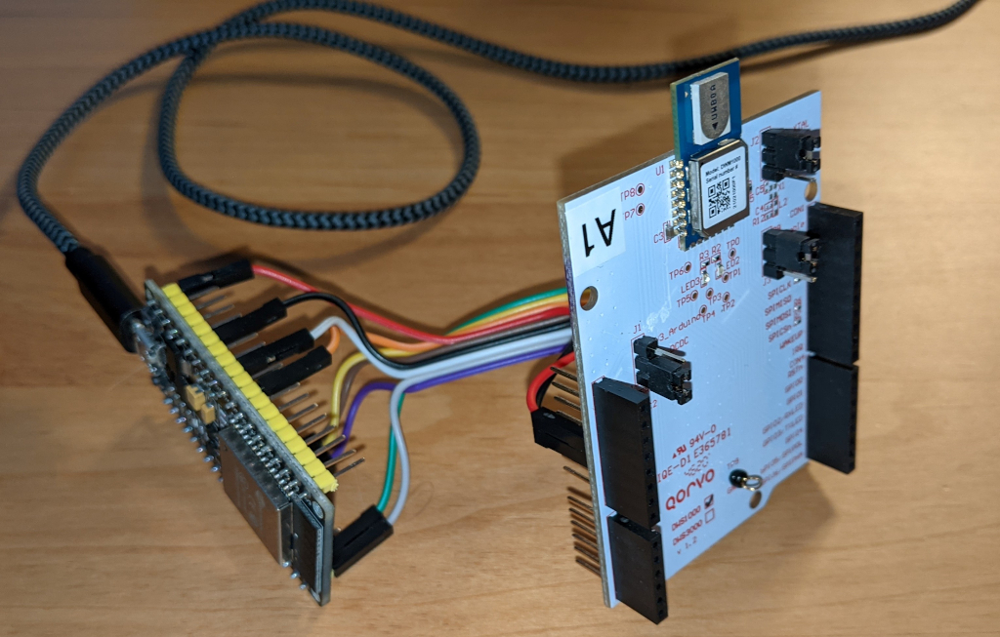

# esp32-dw1000-lite
 
Very Basic Two-Way-Ranging Application with DW1000 and ESP32
=============================================================

Description
------------

This is a simple application of the  "DW1000lite" library and its example programs for
ranging as contributed at https://github.com/Richardn2002/arduino-dw1000-lite, but adapted 
to the ESP32 running with Arduino-Platform. Another minor code change relates to a more
formalized antenna calibration (the original code used a "magic" offset value).
As stated by the original author, this is not a full-fledged solution, but a way to get 
started with DW1000 very fast and test basic ranging functionality. See the original project 
at https://github.com/Richardn2002/arduino-dw1000-lite for further caveats and restrictions.

The test application was used as a quick proof-of-concept for determining both distance of a remote 
(moving) "Responder"/tag from a base of two "Initiators"/anchors at a fixed base distance of 
e.g. 50cm as well as using the difference of the two measured distances to estimate direction (thus 
providing an answer to question: "Is tag more to the left or to the right and approx. by how much?):

```

                                Responder/Tag
                                       O
                                     /   \
                                    /     \
                                   /       \      ^
                                  /         \     |  UWB (802.15.4a @6489.6 GHz)
                                 /           \    v
                                /             \
                               /               \
                              o                 o
                        Initiator/Anchor  Initiator/Anchor
                            "Master"          "Slave"
                                       <--> 
                                     ESP-NOW 
                        (Espressif proprietary @2.4 GHz)     
```                                                       

With this setup and after antenna calibration (= systematically measuring range using different calibration 
values), the advertised **ranging precision around +/- 10cm** could indeed be achieved within the lab room limits
of 50 to 500cm.

Function
---------

Both anchors (initiators) take turns at exchanging a POLL-REPLY-FINAL-DATA 2-way double-sided ranging 
conversation with the remote responder/tag: The master measures its distance, than sends an ESP-NOW 
frame to the slave to indicate that it's its turn. When the slave has finished its measurement, it sends 
the measured distance with an ESP-NOW reply frame, enabling the master to calculate the delta 
(difference of distance) and then kicking off the next train of measurements.

DS-TWR-Initiator-Master, DS-TWR-Initiator-Slave and DS-TWR-Responder utilize the same hardware - ESP32 
and DWS1000 shield, see below (and share most of the - simple - code):



The DS-TWR-Initiator-Slave is synchronized to the DS-TWR-Initiator-Master (so there is always
only _one_ anchor performing ranging) using a simple frame exchange via ESP-NOW, as this is readily
available on ESP32 (this could of course be achieved 
by other means e.g. using UWB itself -- but not with this library). 

Note that the Responder/Tag does no frame filterung and is ignorant of the specific anchor it is dealing with.

Pin Connections
----------------

```
    ESP32                        DWS1000 (with DWM1000)
    OUT: GND--------------------------IN:  GND   (= 0V: CON2 Pin 6 .. equiv to Arduino GND in .. 3rd from bottom upwards)
    OUT: Ext-5V-----------------------IN:  5V    (Power to onboard DC-DC: CON2 Pin 5 .. equiv. to Arduino 5V out .. 4th from bottom upwards)
    OUT: SS pin GPIO5-----------------IN:  SPICSn(Chip Select in: CON1 Pin 3 .. 3rd from bottom upwards)
    OUT: SCK SPI pin GPIO18-----------IN:  SCK   (SPI clock in:  CON1 Pin 6 .. 6th from bottom upwards)
    OUT: MOSI SPI pin GPIO23----------IN:  MOSI  (SPI Data in: CON1 Pin 4 .. 4th from bottom upwards)
    IN:  MISO SPI pin GPIO19----------OUT: MISO  (SPI Data out: CON1 Pin 5 .. 5th from bottom upwards) 
    OUT: RESET pin GPIO25-------------IN:  RSTn  (OpenDrain! CON4 on Pin 8 ... 8th from bottom upwards, 1st from top)    

    Note: Above pinout is for VSPI on ESP32 (NodeMCU/DevKitC) with Arduino lib!     

    Not used:
    IN: interrupt D0 pin GPIO27-------OUT: IRQ  (interrupt request out: CON1 Pin 1 .. equiv. to Arduino CLK0 ..1st from bottom upwards)
```

License
-------
This project is under MIT license, as was the original project by Richardn (thanks Richardn!).

Copyright 2021 matdru

Permission is hereby granted, free of charge, to any person obtaining a copy of this software and associated documentation files (the "Software"), to deal in the Software without restriction, including without limitation the rights to use, copy, modify, merge, publish, distribute, sublicense, and/or sell copies of the Software, and to permit persons to whom the Software is furnished to do so, subject to the following conditions:

The above copyright notice and this permission notice shall be included in all copies or substantial portions of the Software.

THE SOFTWARE IS PROVIDED "AS IS", WITHOUT WARRANTY OF ANY KIND, EXPRESS OR IMPLIED, INCLUDING BUT NOT LIMITED TO THE WARRANTIES OF MERCHANTABILITY, FITNESS FOR A PARTICULAR PURPOSE AND NONINFRINGEMENT. IN NO EVENT SHALL THE AUTHORS OR COPYRIGHT HOLDERS BE LIABLE FOR ANY CLAIM, DAMAGES OR OTHER LIABILITY, WHETHER IN AN ACTION OF CONTRACT, TORT OR OTHERWISE, ARISING FROM, OUT OF OR IN CONNECTION WITH THE SOFTWARE OR THE USE OR OTHER DEALINGS IN THE SOFTWARE.
